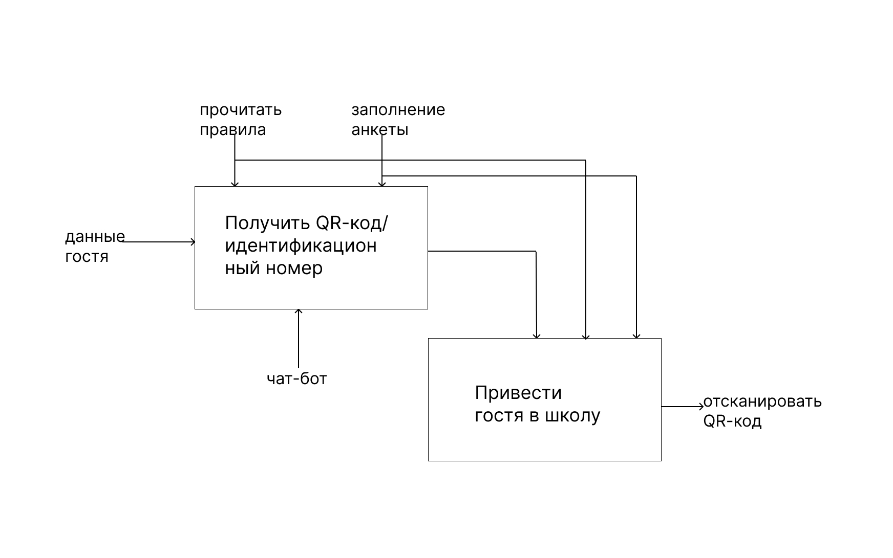

## Формализация постановки задачи

Входящие – вводные, которые ставят определенную задачу:  
 1. Данные гостя.

Исходящие – выводящие результат деятельности:  
 1. Отсканировать QR-код.

Управляющие (сверху вниз) – механизмы управления (положения, инструкции и пр):  
 1. Прочитать правила.  
 2. Заполнени анкеты.  

Механизмы (снизу вверх) – что используется для того, чтобы произвести необходимую работу:  
1. Чат-бот.

